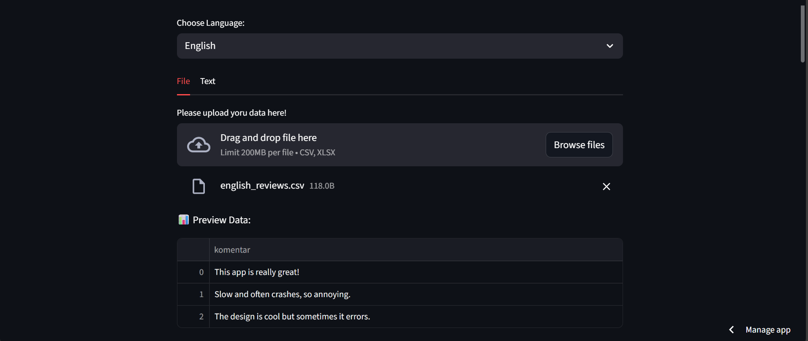
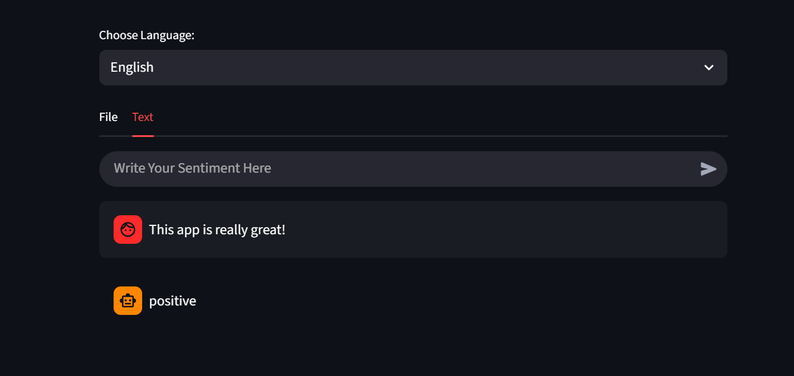

# 📊 Review Sentiment Analyzer


## 📌 Overview
**Review Sentiment Analyzer** is a comprehensive NLP Dashboard designed to analyze customer feedback, social media comments, and product reviews. Unlike simple classifiers, this tool supports **Bilingual Analysis (English & Indonesian)** using state-of-the-art **RoBERTa Transformer models**.

The application allows for both real-time text analysis and bulk processing of datasets (CSV/Excel), providing deep insights through N-Gram extraction and text complexity statistics.

## ✨ Key Features

### 🌍 Bilingual Support
* **English Analysis:** Powered by `cardiffnlp/twitter-roberta-base-sentiment-latest`.
* **Indonesian Analysis:** Powered by `w11wo/indonesian-roberta-base-sentiment-classifier`.

### 📂 Batch Data Processing
* **Multi-Format Upload:** Supports **.csv** and **.xlsx** (Excel) files.
* **Automated Labeling:** Classifies thousands of rows in seconds.
* **Export Ready:** Download the analyzed results directly as CSV.

### 📈 Deep Analytics & Visualization
* **Sentiment Distribution:** Interactive Pie Charts using **Plotly**.
* **Keyword Extraction (N-Grams):** Discover the most frequent words or phrases (Unigrams, Bigrams, Trigrams) associated with specific sentiments (e.g., "What words appear most in Negative reviews?").
* **Text Complexity Stats:** Automatically calculates and visualizes:
    * Average Sentence Length.
    * Average Word Count per sentiment.

### 💬 Real-Time Playground
* A chat-like interface to test the model with single sentences on the fly.

## 🛠️ Tech Stack
* **Framework:** Streamlit
* **Models:** Hugging Face Transformers (PyTorch backend)
* **Data Handling:** Pandas, OpenPyXL
* **Visualization:** Plotly Express
* **NLP Utilities:** Scikit-learn (CountVectorizer), NLTK, RegEx

### 🔍 Analytical Capabilities

Beyond simple classification, this dashboard provides deep linguistic insights:

* **Automated Sentiment Labeling:** Utilizes Transformer-based models (RoBERTa) to classify text into Positive, Negative, or Neutral with high contextual accuracy.
* **N-Gram Keyword Extraction:** Identifies top frequent words (Unigrams) and phrases (Bigrams/Trigrams) to uncover the *root causes* of specific sentiments (e.g., detecting "slow shipping" appearing frequently in negative reviews).
* **Text Complexity & Correlation Analysis:** Aggregates linguistic metrics by sentiment group to reveal behavioral patterns:
    * *Sentiment vs. Sentence Length:* Analyzes if specific sentiments (e.g., Negative) tend to have significantly longer sentences, indicating detailed complaints vs. short praises.
    * *Sentiment vs. Word Count:* Compares the average verbosity across different sentiment categories.
* **Interactive Distribution Metrics:** Visualizes the overall sentiment balance using dynamic Pie Charts and Bar Graphs to spot trends instantly.

## 🚀 Installation & Usage

1.  **Clone the Repository**
    ```bash
    git clone https://github.com/viochris/Simple-Sentiment-Analysis.git
    cd Simple-Sentiment-Analysis
    ```

2.  **Install Dependencies**
    ```bash
    pip install -r requirements.txt
    ```

3.  **Run the Dashboard**
    ```bash
    streamlit run dashboard.py
    ```

4.  **How to Use**
    * Select your target language (English/Indonesia) from the dropdown.
    * **Tab "File":** Upload your dataset to see charts, N-grams, and download results.
    * **Tab "Text":** Type manually to check sentiment in real-time.

### 🧪 Sample Data for Testing
Don't have a dataset ready? You can use the sample files provided in this repository to test the dashboard immediately:

* **English Data:** `sample_data/english_reviews.csv` (CSV format)
* **Indonesian Data:** `sample_data/indo_reviews.xlsx` (Excel format)

*Tip: Download these files and upload them in the "File" tab to see the analytics in action!*

## 📷 Screenshots

### 📊 Batch Data Analysis
Upload CSV or Excel files to get instant visual analytics and sentiment distribution:


### 💬 Real-Time Text Analysis
Test the model with individual sentences using the interactive text mode:


---
**Author:** [Silvio Christian, Joe](https://github.com/viochris)
*"Turning unstructured text into actionable insights."*
